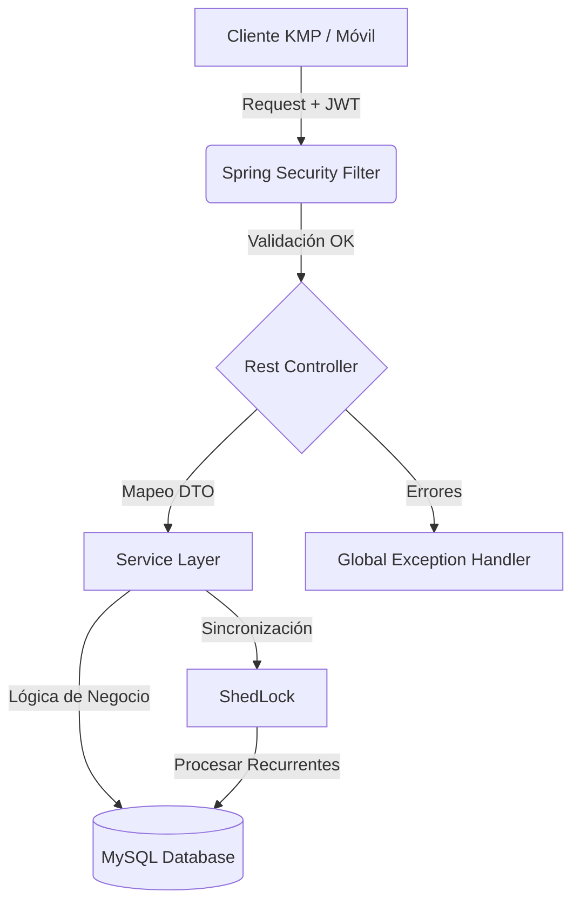

# 💸 Nexflow-api

<p align="left">
  
  
  
  
  
</p>

**Nexflow-api** es un backend robusto, seguro y escalable diseñado para la gestión integral de finanzas personales. Desarrollado originalmente para dar soporte a una aplicación móvil multiplataforma (KMP), esta API centraliza la lógica de negocio, la seguridad de las sesiones y la persistencia de datos bajo principios de arquitectura limpia.

👉 **[Ver Documentación Interactiva (Swagger) aquí](https://nexflow-api.onrender.com/doc)**

> ⚠️ **Nota sobre el despliegue:** Actualmente la API está alojada en el *tier* gratuito de Render. Si el servidor se encuentra en estado de suspensión (Cold Start), **la primera petición puede tardar alrededor de 50 segundos en responder**. Agradezco tu paciencia.

<br>

---

## 📖 Tabla de Contenidos
- [Sobre el Proyecto](#-sobre-el-proyecto)
- [Características Destacadas](#-características-destacadas)
- [Arquitectura y Base de Datos](#-arquitectura-y-base-de-datos)
- [Stack Tecnológico](#-stack-tecnológico)
- [Estructura del Proyecto](#-estructura-del-proyecto)
- [Pruebas y Calidad](#-pruebas-y-calidad)
- [Ejecución en Entorno Local](#-ejecución-en-entorno-local)
- [Ejemplo de Uso (API)](#-ejemplo-de-uso-api)
- [Roadmap](#-roadmap)

---

<br>


## 💡 Sobre el Proyecto
El objetivo principal de Nexflow-api es proporcionar una fuente de verdad única y fiable para la gestión de gastos, presupuestos y suscripciones de los usuarios. Al construir un backend propio y desacoplado, el proyecto garantiza un control total sobre la seguridad de los datos, la validación estricta de las transacciones financieras y la preparación para escalar a futuras plataformas (Web, iOS, etc.).

<br>

## ✨ Características Destacadas
A diferencia de un simple CRUD, esta API implementa soluciones a retos comunes en el entorno Fintech:
* **Gestión Avanzada de Sesiones:** Implementación de JWT (JSON Web Tokens) junto con un sistema de `Refresh Tokens` respaldado en base de datos (`user_sessions`). Esto permite rastrear dispositivos conectados y revocar accesos específicos, elevando el estándar de seguridad.
* **Motor de Tareas Programadas (Cron Jobs):** Utilizando **ShedLock**, la API procesa pagos recurrentes y suscripciones (`recurring_plans`). ShedLock garantiza que, si la infraestructura escala a múltiples instancias, los procesos por lotes se ejecuten una única vez, evitando la duplicidad de cobros.
* **Manejo Seguro de Divisas:** Todas las transacciones monetarias se almacenan y procesan en céntimos (`balance_in_cents` como `integer`) para evitar por completo los errores de pérdida de precisión inherentes al uso de coma flotante (`float`/`double`).

<br>

## 🏗️ Arquitectura y Base de Datos

*[ 📌 NOTA: Reemplaza este texto por la imagen de tu diagrama de base de datos (``) ]*

Para la capa de persistencia se ha optado por una **Base de Datos Relacional (MySQL)**. Al gestionar información financiera, carteras y balances, la prioridad absoluta del sistema es garantizar la **integridad referencial de los datos y el cumplimiento ACID** en cada transacción.



<br>

## 🛠️ Stack Tecnológico

* **Core:** Java 17+, Spring Boot (Web, Data JPA, Validation).
* **Seguridad:** Spring Security + JJWT (Autenticación sin estado).
* **Persistencia:** MySQL, Spring Data JPA.
* **Sincronización de Procesos:** ShedLock (Provider JDBC Template).
* **Infraestructura y QA:** Docker, Docker Compose, Testcontainers.
* **Herramientas de Desarrollo:** Lombok, Spring Boot DevTools, SpringDoc OpenAPI (Swagger UI).

<br>

## 📂 Estructura del Proyecto
```
src/main/java/com/nexflow
├── advice/               # Controladores de excepciones globales
├── annotation/           # Anotaciones personalizadas para Swagger
├── config/               # Configuración de Security, JWT y Beans
├── controller/           # Puntos de entrada (REST Endpoints)
├── dto/                  # Objetos de transferencia de datos (Request/Response)
├── exceptions/           # Excepciones personalizadas de negocio
├── manager/              # Componentes de gestión intermedia
├── mappers/              # Lógica de conversión Entidad <-> DTO
├── model/                # Entidades JPA (Persistencia)
├── repositories/         # Capa de acceso a datos (Spring Data JPA)
├── service/              # Lógica principal de negocio
└── util/                 # Clases de utilidad y constantes
```

<br>

## 🧪 Pruebas y Calidad
El código está respaldado por una suite de pruebas automatizadas que abarca **Unit Tests** e **Integration Tests**. 

Para asegurar que las pruebas de integración sean deterministas y se ejecuten en un entorno idéntico a producción, se hace uso de **Testcontainers** levantando una instancia aislada de MySQL durante la fase de testing.

<br>

## 🚀 Ejecución en Entorno Local

Actualmente, el proyecto está configurado para ejecutarse de forma óptima en el perfil de desarrollo (`dev`).

**Prerrequisitos:**
- Java 17 o superior.
- Maven.
- Docker y Docker Compose instalados y en ejecución.

**Pasos para el despliegue local:**

1. **Clonar el repositorio**   
  ```
  git clone [https://github.com/tu-usuario/nexflow-api.git](https://github.com/tu-usuario/nexflow-api.git)
  cd nexflow-api
  ```
2. **Infraestructura (Base de Datos)**
Para levantar la base de datos MySQL local con Docker:
  ```
  docker-compose up -d
  ```
3. **Ejecutar la api**
  ```
  mvn spring-boot:run -Dspring-boot.run.profiles=dev
  ```

💡 La API estará disponible en http://localhost:8080.

<br>

## 📡 Ejemplo de Uso (API)

#### Petición: Registrar un nuevo gasto
```
POST {Base path}/nexflow/api/transactions
```
```
{
  "title": "Groceries",
  "description": "Weekly shopping at local supermarket",
  "balanceInCents": 4550,
  "type": "EXPENSE",
  "date": "2026-04-15T15:30:00Z",
  "categoryId": 12,
  "walletId": 1
}
```
#### Respuesta Exitosa (201 Created)
```
{
  "data": {
    "id": 5001,
    "title": "Supermarket",
    "description": "Weekly grocery shopping",
    "balanceInCents": 5240,
    "type": "EXPENSE",
    "date": "2026-04-15T18:30:00",
    "status": "COMPLETED",
    "category": {
      "id": 1,
      "name": "Leisure",
      "iconResource": "/icons/leisure.svg",
      "createdAt": "2026-04-15T10:00:00",
      "updatedAt": "2026-04-15T12:30:00"
    },
    "walletId": 1,
    "planId": 101,

    "createdAt": "2026-04-15T18:31:00",
    "updatedAt": "2026-04-15T18:31:00"
  }
}
```

<br>

## ⬜ Roadmap

### 🔹 Core & Architecture

* [x] Estructura base con Spring Boot 3.x
* [x] Lógica de negocio para Wallets y Transactions
* [x] Manejo de dinero en céntimos (Integer)
* [ ] Endpoints Reactivos: WebSockets/SSE para notificaciones en tiempo real
* [ ] Búsqueda avanzada: Filtros complejos de historial

###🔹 Security & Auth

* [x] Integración de Spring Security y JWT
* [x] Sistema de Refresh Tokens con persistencia
* [x] Roles & Permissions: Refinamiento de niveles de acceso
* [ ] OAuth2.0: Inicio de sesión con Google/GitHub

###🔹 Database & Infra

* [x] Dockerización de la base de datos (Dev)
* [x] Configuración de perfiles (dev/prod)
* [ ] Flyway: Control de versiones del esquema de base de datos
* [ ] Despliegue Full Docker: Dockerizar la aplicación completa

###🔹 Testing & QA

* [x] Unit Tests para servicios principales
* [x] Integration Tests con Testcontainers
* [ ] Optimización de Tests: Implementación del patrón Singleton en Testcontainers
* [ ] CI/CD: GitHub Actions para ejecución automática de tests

###🔹 Automation

* [x] Procesamiento de planes recurrentes con ShedLock
* [ ] Reportes automáticos vía Email


